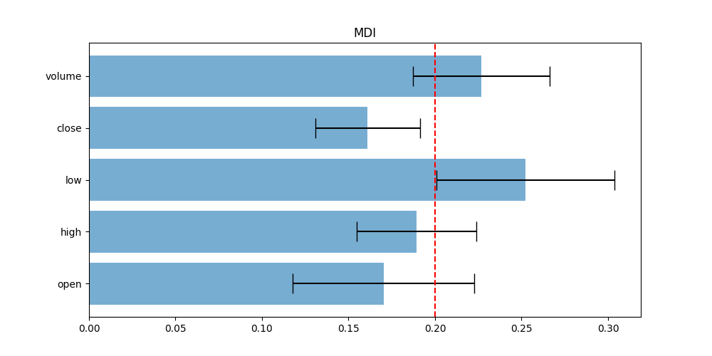
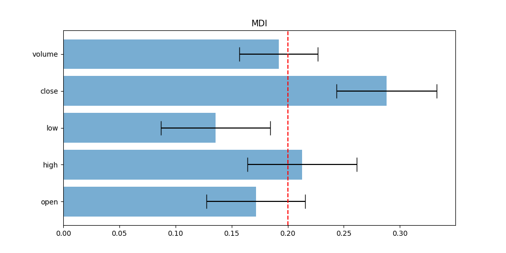
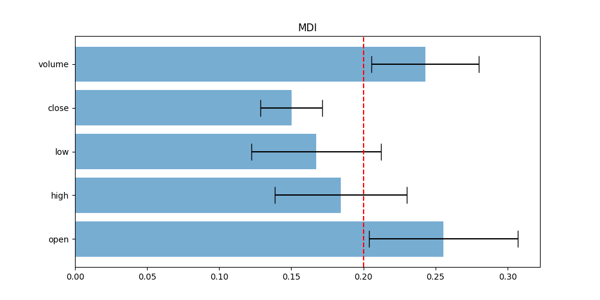
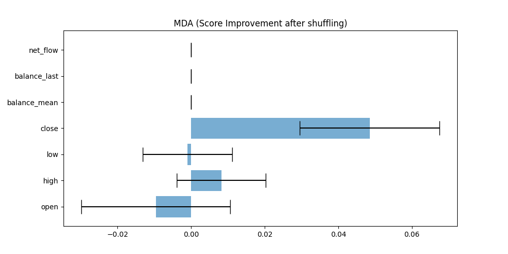
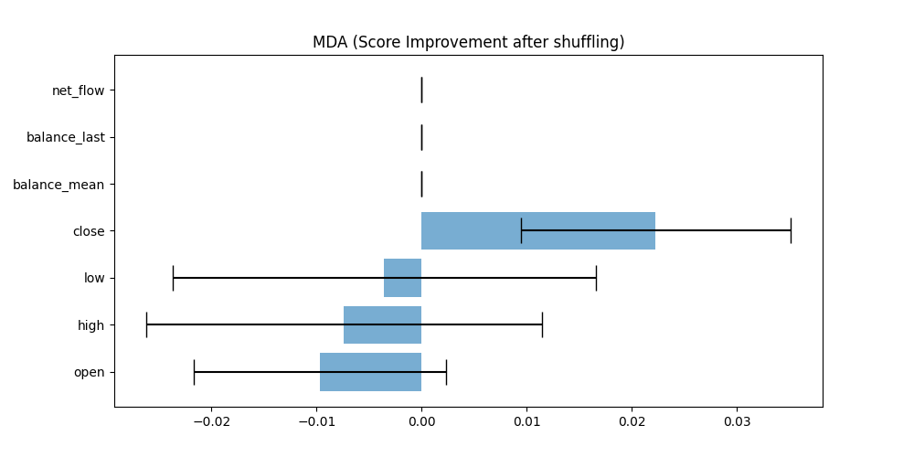
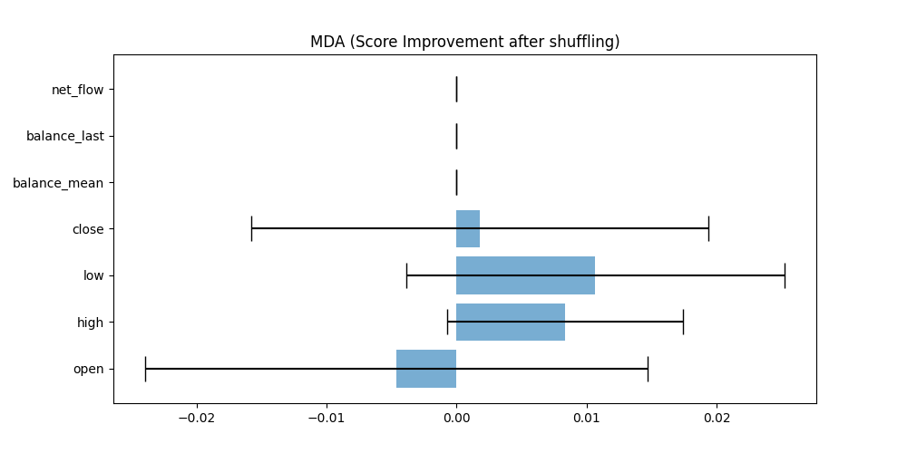
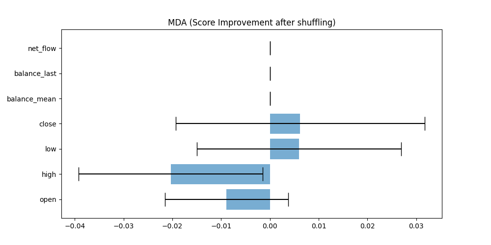
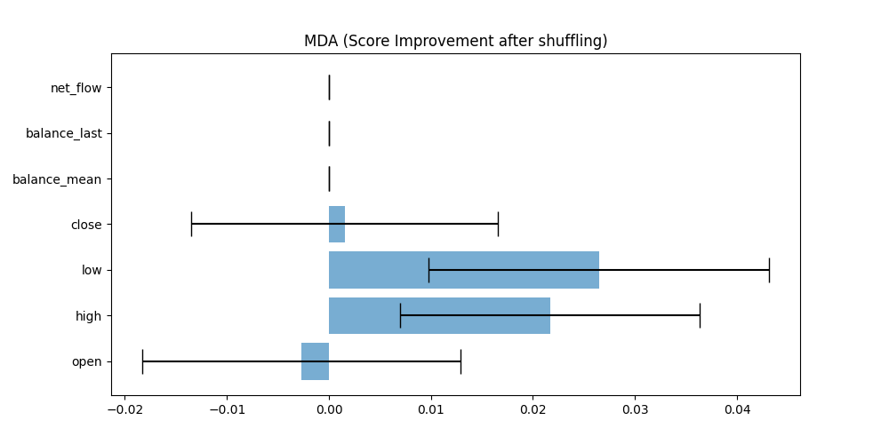

# Financial Modeling

This repository contains a comprehensive pipeline for financial machine learning. It implements Purged K-Fold Cross Validation, Combinatorial Purged K-Fold Cross Validation, and Feature Importance evaluation (MDI, MDA).

## Pipeline Overview

The pipeline consists of the following steps:

1. Signal extraction using Signaler
1. Labeling with Labeler
1. Preprocessing and feature engineering with FeatureEngineer
1. Modeling

The pipeline is designed for customization. Each step is a class that can be customized or replaced. It is compatible with any processes suggested by "Advances in Financial Machine Learning", specifically the sections before and including Combinatorial Purged K-Fold Cross Validation.

FeatureEngineer includes functionality for shuffling data before or after PCA for the purpose of feature importance evaluation. The sklearn cross validation object was not suitable for this pipeline's cross-validation process, so a custom one was built, along with a scorer for cross-validation.

## Cross Validation Process

1. The model is first fitted to the training data to extract starting point dependent signals and the first touch (barrier) time of each signal.
1. The first touch time is reindexed to the close index and fed into the cv object for a non-overlapping split. Signals are fed into the pipeline.
1. Classic cross-validation is then performed.

MDA is also modified in a similar manner. Hyperparameter tuning is now fully automated.

## Overfitting Detection

In the world of Financial Machine Learning, overfitting remains a significant obstacle. In response to this, this project incorporates specific features designed to identify instances of overfitting.

It's important to note that this model was intentionally regularized to lower the likelihood of overfitting. Specific parameters were adjusted: the min_child_weight was configured to 0.05, the colsample_bytree was set to 0.1 following the recommendations in the book "Advances in Financial Machine Learning" (AFML), and the subsample was established at 0.75, as determined through a uniqueness calculation. These strategic adjustments were implemented to control model complexity and discourage overfitting to the training data, thus enhancing the model's ability to generalize to unseen data.

Furthermore, the Combinatorial Purged K-Fold methodology was employed as an additional measure to detect overfitting.

### TLT Price Data Test

The pipeline was tested by performing hyperparameter tuning on TLT price data, an ETF that tracks 20+ years of US treasury bond. If the pipeline can extract alpha from this data, it is likely overfitting.

The results, including Feature Importance evaluation, can be viewed in the plots provided.

The tests revealed that MDI on TLT price data is not very stable, and the top features are inconsistent.

I performed hyperparameter tuning (40 iterations, as more iterations might risks overfitting) on TLT With Mean return of -0.0016 on average, deducted commission of 0.001.

### TMF Data Test

A test was also performed on TMF data (3x leverage of TLT) using only Purged K-Fold to check if the pipeline could overfit. The pipeline found a mean return of 0.002, though this result could not be reproduced on Combinatorial Purged K-Fold. Proving the robustness of Combinatorial Purged K-Fold.

## BTC Price and fundamental Data Test

The pipeline was also tested by performing hyperparameter tuning on BTC price data and an event data set recording the number of accounts with certain amounts of BTC in Binance and net flow into Binance, both in terms of BTC.

The results, including Feature Importance evaluation, can be viewed in the plots provided.

The results from the BTC tests are more consistent, with "open" consistently leading to score deduction after shuffling.

The fact that only the "open" (the initial price of BTC at the onset of a given period) appears to reduce the score after being shuffled implies that the intra-period price variations might not be the pivotal determinants for the label. This observation can lead to various hypotheses, and I would like to propose one:

Given that our sampling relies on the accumulation of balance, which is triggered by a series of increases and decreases, buy-ins and sell-outs during the sample period, it's plausible to suggest that these actions are reactions to the price change of BTC from a prior period, likely one sample before.

This collective sentiment, triggered by the price change from the previous period, is then manifested in the price change of the current and potentially subsequent samples. The latter is the exact label that we are striving to forecast. This hypothesis, if validated, could provide valuable insights into the dynamics of price movements and the factors influencing them.

I performed hyperparameter tuning with 40 iterations, these are the result:
{'signaler__cusum_threshold': 0.02,
'model': xgboost.XGBClassifier(min_child_weight=0.05,colsample_bytree=0.1,subsample=0.7),
'model__learning_rate': 0.1,
'model__n_estimators': 5000, 'model__max_depth': 3, 'feature_engineer__X_pipe__ImproveSkewness': Fracdiff(d=0.75), 'feature_engineer__X_pipe__DimensionReduction': None, 
'labeler__primary_model': crossing_ma(fast_slow=(10, 20)), 'labeler__min_target': 0.0005,
'labeler__ptsl_scalers': (2, 2),
'labeler__ewma_window': 50,
'enable_sample_weight': False}

Return is 0.00107 on average , 0.001 commission already deducted,
a very marginal and risky return on daily frequency.

The pipeline is then trained on training data again with the best parameters (cross validation were performed with training data only) and tested on test data, the mean return is -0.00099 with 0.001 commission deducted.
Presumably due to the volatile nature of BTC and the short length of data.
A much more robust model is needed to extract alpha from BTC.

Note:

1. signaler__cusum_threshold is set to 0.02 since I set the a hard limit on sampling number over series number to 0.2 to 0.5. signaler__cusum_threshold == 0.01 sampled over 0.6 of series.
2. Fracdiff(d=0.75) is the lowest number to make all chosen columns(only "open" in this case) stationary.

## Netflow Data Test

The pipeline was also applied to net flow data with a cumulative sum filter.

Again, "open" is the only feature that consistently leads to score deduction after shuffling.

The results of hyperparameter tuning:

{'signaler__cusum_threshold': 5,
'model': xgboost.XGBClassifier(min_child_weight=0.05,colsample_bytree=0.1,subsample=0.7),
'feature_engineer__X_pipe__DimensionReduction': None,
'labeler__primary_model': crossing_ma(fast_slow=(50, 100)), 'labeler__min_target': 0.002,
'labeler__ptsl_scalers': (1, 5),
'labeler__ewma_window': 10,
'enable_sample_weight': False}

0.00128 return on average, 0.001 commission already deducted.
Again,a very marginal and risky return on daily frequency.

The pipeline is then trained on training data again with the best parameters (cross validation were performed with training data only) and tested on test data, the mean return is -0.00102 with 0.001 commission deducted.

## Conclusion

The Financial Machine Learning pipeline presented here demonstrates a comprehensive, customizable approach to financial data analysis. The pipeline leverages advanced techniques such as Purged K-Fold Cross Validation, Combinatorial Purged K-Fold Cross Validation, and Feature Importance evaluation (MDI, MDA), providing a robust and flexible platform for financial machine learning tasks.

Tests performed with various financial datasets, including TLT price data, TMF data, BTC price data, and BTC net flow data, demonstrated the pipeline's capabilities in extracting meaningful information. However, these results also highlighted the challenges of overfitting and the necessity of robust methodologies to mitigate this risk.

In the case of TLT and TMF data, the pipeline revealed instability and inconsistency, particularly in the results generated from MDI. This was also evident in the BTC price data and net flow data tests. However, the BTC tests also provided intriguing insights, such as the significance of 'open' prices as a consistent feature leading to score deduction after shuffling.

Results from hyperparameter tuning demonstrated marginal and risky returns on daily frequency across all datasets tested. This indicates the need for further optimization and potentially the inclusion of more robust models to extract more valuable insights from the data.

In conclusion, while the pipeline shows promise, it also illustrates that financial machine learning remains a complex field, where the balance between model complexity, overfitting, and the ability to extract meaningful insights is a constant challenge. Further improvements and testing will be crucial to enhance the pipeline's performance and make it a more reliable tool for financial data analysis.

We hope that this repository will serve as a starting point for others interested in financial machine learning. The pipeline is open for customization, and we look forward to seeing how it can be further improved and adapted to meet various needs and challenges in the field of finance. Contributions, suggestions, and insights from the community are most welcome.